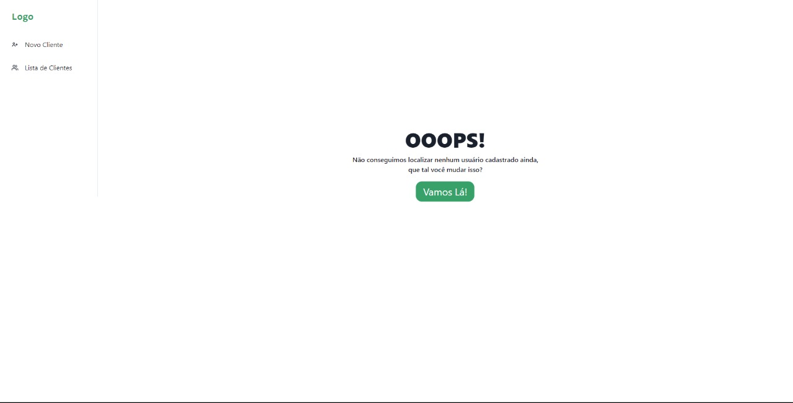
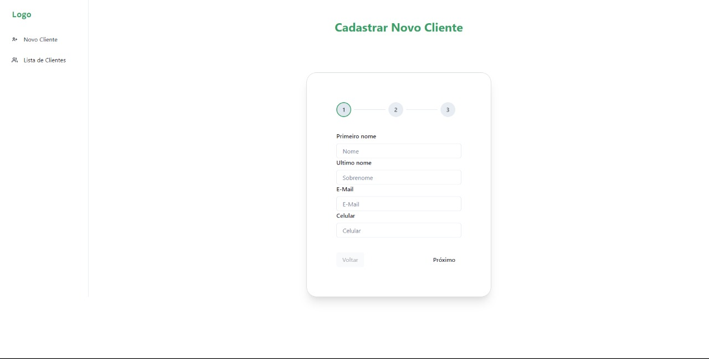

# Teste Front-end Developer




> Projeto desenvolvido como teste para Front-end Developer

### Objetivo

Criar um web app simples de cadastro no formato stepper (Wizard) utilizando React.JS

### Requisitos

O projeto ainda está em desenvolvimento e as próximas atualizações serão voltadas nas seguintes tarefas:

- A aplicação deve conter um menu lateral com dois itens ('Novo Cliente' e ' Lista de
  Clientes')
- A opção 'Novo Cliente' deve iniciar o formulário no passo 1
- Passo 1 deve conter os campos: Nome, Sobrenome, E-mail, Telefone
- Passo 2 deve conter os campos: CEP, Endereço 1, Endereço 2
- Passo 3 deve conter os campos: Data de Nascimento, CPF, Renda Mensal
- Passo 4 deve conter uma mensagem de cadastro concluído com sucesso
- A opção 'Lista de Clientes' deve listar todos os clientes cadastrados
- Ainda na opção 'Lista de Clientes' deve ser possível clicar em um cliente e visualizar os
  dados do mesmo
- Não esqueça de colocar os botões de 'Voltar' em cada Step do formulário
- Capriche na UX e lembre-se que seu teste pode ser testado em um dispositivo móvel,
  portanto preocupe-se com a responsividade

## 💻 Pré-requisitos

Antes de começar, verifique se você atendeu aos seguintes requisitos:

- Você tem instalado na sua máquina `Git, Git Bash(Windows), Nodejs, npm / yarn`
- Você tem uma máquina `<Windows / Linux / Mac>`

## 🚀 Clonando o repositório

Antes de qualquer coisa é necessário clonar o repositório, para isso em seu terminal navegue até o diretório que deseja salvar o projeto e rode um dos seguintes comandos:

Linux, macOS e Windows:

`HTTPS Mode:`

```
git clone https://github.com/nathanosti/venture-labs-test.git
```

`SSH Mode:`

```
git clone git@github.com:nathanosti/venture-labs-test.git
```

## Acessar pasta após clonar o repositório

Após clonar é necessário acessar a pasta gerada. Para isso abra seu VS Code ou editor de sua preferência, depois clique em File (Arquivos) > Open Folder (Abrir Pasta) e acesse o diretório aonde você salvou o clone.

## ➕ Instalando dependências

Para conseguir rodar o projeto localmente, é OBRIGATÓRIO instalar as suas dependências, para isso basta seguir os seguintes passos.

Dentro da raiz do projeto no mesmo lugar que se encontra o arquivo package.json, rode um dos seguintes comandos pelo terminal:

`Utilizando Yarn`

```
  yarn
```

`Utilizando npm`

```
  npm install
```

## ✨ Rodando projeto local

Agora para conseguir rodar o projeto local após instalar as dependências, ainda dentro da raiz do projeto rode um dos comando pelo terminal:

`Utilizando Yarn`

```
  yarn dev
```

`Utilizando npm`

```
  npm run dev
```

Após seguir todos esses passos o projeto já está pronto para ser testado. 😄

## 👷  Projeto desenvolvido por - Nathan Osti Miguel 👷 
